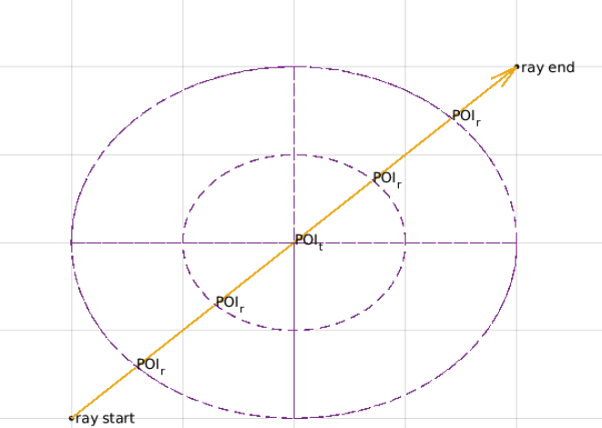

# Fast Voxel Traversal Algorithm Over Spherical Coordinate Grid

_Traversal algorithm through the 2-dimensional voxel polar coordinate system_

## About
This project extends the [yt](https://yt-project.org/) open-source data analysis and visualization package, providing an enhanced, integrated user interface for data exploration and enabling the visualization of physical data that comes from non-cartesian grids. Overall, the project will expand the accessibility and functionality of the yt visualization package. Yt currently implements a fast voxel traversal on cartesian grids as a Python function with C components; we are developing a fast voxel traversal over spherical grids using ideas from Amanatides and Woo’s seminal paper on fast voxel traversal for ray tracing. Part of this endeavour will include providing thorough documentation for both our function and the current function provided in yt. 

## Authors
- Chris Gyurgyik (cpg49@cornell.edu)
- Ariel Kellison (ak2485@cornell.edu)
- Youhan Yuan (yy435@cornell.edu)

### Algorithm Team Links
- [Fast Voxel Traversal Algorithm Overview](https://docs.google.com/document/d/1QvWw81A0T5vcMAt1WElDeSdBmsw0KJvJdYNr7XfRHfw/edit)
- [Modern C++ implementation of "A Fast Voxel Traversal Algorithm"](https://github.com/cgyurgyik/fast-voxel-traversal-algorithm)

### Project Links
- [Initial Proposal](https://hackmd.io/VRyhXnAFQyaCytWCdKe_1Q)
- [Feasibility Study](https://docs.google.com/document/d/1MbGmy5cSSesI0oUCWHxpiwcHEw6kqd79AV1XZW-rEZo/edit)
- [Progress Report 1](https://docs.google.com/document/d/1ixD7XNu39kwwXhvQooMNb79x18-GsyMPLodzvwC3X-E/edit?ts=5e5d6f45#)

### References
- [MATLAB code for Amanatides & Woo's algorithm and Smit's algorithm](https://www.mathworks.com/matlabcentral/fileexchange/26852-a-fast-voxel-traversal-algorithm-for-ray-tracing)
- John Amanatides and Andrew Woo. A fast voxel traversal algorithm for ray tracing. In In Eurographics ’87, pages 3–10, 1987.
- Paul S. Heckbert, editor. Graphics Gems IV.  Academic Press Professional, Inc., USA, 1994.
